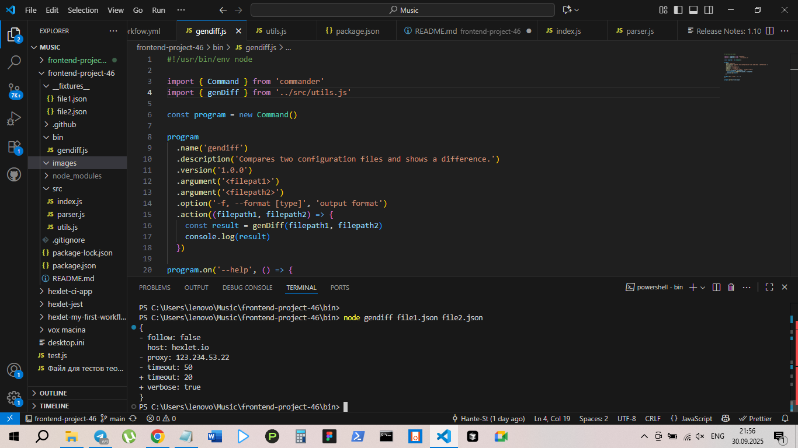

### Hexlet tests and linter status:

Description
Compares two files for differences. 

Supports the following formats:
JSON
YAML/YML

Installation:
make install

Usage
node gendiff 'path-to-file1' 'path-to-file2'

Example of a genDiff work:

